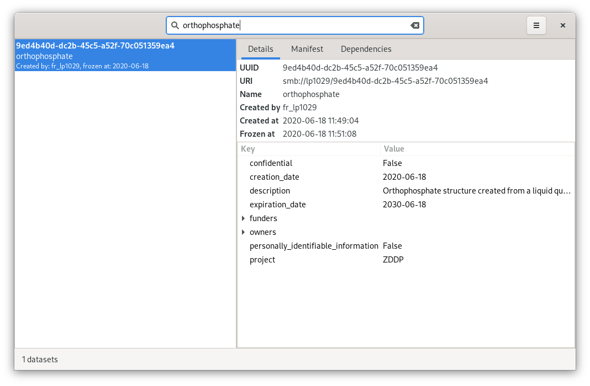

dtool-lookup-gui
================

.. image:: https://badge.fury.io/py/dtool-lookup-gui.svg
    :target: https://badge.fury.io/py/dtool-lookup-gui
    :alt: PyPI package

dtool-lookup-gui is a graphical user interface for dtool_, dtool-lookup-server_ and
dtool-lookup-server-dependency-graph-plugin_ written in Python_ and GTK_.

Requirements
------------

This application requires Gtk_ 3 and GtkSourceView_ 4.

On Ubuntu (20.04),

.. code:: bash

    apt install -y gir1.2-gtksource-4

suffices to to install these dependencies from the standard system package repositories.

On recent macs (>= 10.15) using homebrew, 

.. code:: bash

   brew install gtksourceview4 gnome-icon-theme

on older macs, you have to use a legacy version, 
e.g. https://github.com/IMTEK-Simulation/dtool-lookup-gui/tree/legacy/default_query,
and you refer to the installation instructions therein.

Installation
------------

The application uses setuptools_. It can be installed with pip_:

.. code:: bash

    pip install dtool-lookup-gui

If you want the latest development release, then use:

.. code:: bash

    pip install git+https://github.com/IMTEK-Simulation/dtool-lookup-gui.git

When already clone into a local directly via ``git``, either use pip_ or install via the standard route

.. code:: bash

   python setup.py install

For an editable install,

.. code:: bash

   pip install -e .

also run

.. code:: bash

   glib-compile-schemas .

from within subdirectory ``dtool_lookup_gui``. Otherwise, GUI launch fails with

.. code::

   gi.repository.GLib.Error: g-file-error-quark: Failed to open file “/path/to/repository/dtool_lookup_gui/gschemas.compiled”: open() failed: No such file or directory (4)

Running the GUI
---------------

After installation, run the GUI with:

.. code:: bash

   python -m dtool_lookup_gui

Note that when you run the GUI for the first time, you will need to configure
the URL of the lookup and the authentication server as well as provide a
username and a password. To do this, click on the "Burger" symbol and select
*Settings*.

Development
-----------

Pinned requirements
^^^^^^^^^^^^^^^^^^^

``requirements.in`` contains unpinned dependencies. ``requirements.txt`` with pinned versions has been auto-generated with

.. code:: bash

  pip install pip-tools
  pip-compile requirements.in > requirements.txt

Testing github workflows locally
^^^^^^^^^^^^^^^^^^^^^^^^^^^^^^^^

It is possible to run github workflows locally
with the help of `docker <https://www.docker.com/>`_ and
`act <https://github.com/nektos/act>`_.

`Install and configure act <https://github.com/nektos/act#installation>`_
at a specific version with

.. code-block:: bash

  go install github.com/nektos/act@v0.2.24

and run a workflow with 

.. code-block:: bash

  act -s GITHUB_TOKEN=$GITHUB_TOKEN -W .github/workflows/publish-on-pypi.yml

from within this repository. :code:`$GITHUB_TOKEN` must hold a valid
`access token <https://github.com/settings/tokens>`_.
The evoking user must be member of the :code:`docker` group.

To generate a pyinstaller-packaged application by the according workflow and 
store it locally, use the ``--bind`` flag, i.e.

.. code-block:: bash

  act -s GITHUB_TOKEN=$GITHUB_TOKEN -W .github/workflows/build-on-ubuntu.yml --bind

This will bind-mount the current folder into the workflow-executing container.
All locally generated artifacts will hence survive the container's lifespan,
but usually belong to ``root``. The executable resides below ``dist``. Use 

.. code-block:: bash

   sudo chown -R $USER:$USER .
   git clean -fdx

to remove the generated ``build``, ``dist``, and ``workflow`` folders and all other artifacts.

GUI design
^^^^^^^^^^

The GUI uses custom Gtk widgets. To edit the the XML UI definition files with
Glade_, add the directory ``glade/catalog`` to `Extra Catalog & Template paths`
within Glade's preferences dialog.

.. _dtool: https://github.com/jic-dtool/dtool

.. _dtool-lookup-server: https://github.com/jic-dtool/dtool-lookup-server

.. _dtool-lookup-server-dependency-graph-plugin: https://github.com/IMTEK-Simulation/dtool-lookup-server-dependency-graph-plugin

.. _Glade: https://glade.gnome.org/

.. _GTK: https://www.gtk.org/

.. _GtkSourceView: https://wiki.gnome.org/Projects/GtkSourceView

.. _pip: https://pip.pypa.io/en/stable/

.. _Python: https://www.python.org/

.. _setuptools: https://setuptools.readthedocs.io/en/latest/
