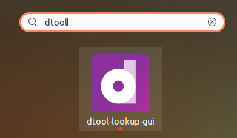

dtool-lookup-gui
================

.. image:: https://img.shields.io/github/actions/workflow/status/livMatS/dtool-lookup-gui/build-and-publish.yml?branch=master
    :target: https://github.com/livMatS/dtool-lookup-gui/actions/workflows/build-and-publish.yml
    :alt: GitHub Workflow Status
.. image:: https://img.shields.io/github/v/release/livMatS/dtool-lookup-gui
    :target: https://github.com/livMatS/dtool-lookup-gui/releases/latest
    :alt: GitHub release (latest by date)
.. image:: https://badge.fury.io/py/dtool-lookup-gui.svg
    :target: https://badge.fury.io/py/dtool-lookup-gui
    :alt: PyPI package

dtool-lookup-gui is a graphical user interface for dtool_, dtool-lookup-server_ and
dtool-lookup-server-dependency-graph-plugin_ written in Python_ and GTK_.

.. image:: data/screenshots/screenshot1.png

Quick start
-----------

Just download the pre-packaged binaries of the `latest release`_
and follow the `quick start guide`_ to get started.

If the binaries won't run out-of-the-box on your system, continue below.

OS-specific notes
-----------------

macOS
^^^^^

After downloading the `dmg` Apple Disk Image of the `latest release`_
and copying `dtool-lookup-gui` over to your `Applications` folder,
*macOS* will likely complain about `dtool-lookup-gui` being damaged
and refuse to execute it. This is due to the fact that we are no
Apple-verified developers. To run the app anyway, open a terminal and
remove Apple's quarantine attribute from the app with

.. code:: bash

    sudo xattr -rds com.apple.quarantine /Applications/dtool-lookup-gui.app

That should enable you to launch the app as usual. Another option is to
call

.. code:: bash

    /Applications/dtool-lookup-gui.app/Contents/MacOS/dtool-lookup-gui

directly from the command line.

Linux
^^^^^

After downloading and extracting the tar.gz-packaged Linux build, you may
run the bundled scripts :code:`set_launcher_icon.sh` and :code:`soft_link_launcher.sh`
subsequently to add this launcher icon to your desktop environment:

This has been tested on Ubuntu 20.04 and GNOME 3.36.8.

The packaged Linux build will fail to launch out-of-the box under Wayland. 
If unsure whih display server is in use, check with

.. code:: bash

   echo $XDG_SESSION_TYPE
   
This will likely output either :code:`x11` or :code:`wayland`.
If you are using Wayland, launch the app with environment variable 
:code:`GDK_BACKEND=x11` set, e.g. via

.. code:: bash

    GDK_BACKEND=x11 ./dtool_lookup_gui

Development
-----------

Please read the `contributing guidelines`_ before diving into the development process.

Requirements
^^^^^^^^^^^^

This application requires Gtk_ 3 and GtkSourceView_ 4.

On Ubuntu (20.04),

.. code:: bash

    apt install -y gir1.2-gtksource-4

suffices to to install these dependencies from the standard system package repositories.

On recent macOS (>= 10.15) use homebrew, 

.. code:: bash

   brew install gtksourceview4 gnome-icon-theme

On earlie macOs, `MacPorts <https://www.macports.org/>`_ allows the installation of `gtksourceview4`

.. code:: bash
   
   sudo port -v selfupdate
   sudo port install xorg-server
   sudo port install gtksourceview4 py-gobject3 py-pip py-numpy py-scipy
   sudo port install adwaita-icon-theme

   sudo port select --set python python310
   sudo port select --set pip pip310

   mkdir -p ~/venv
   python -m venv --system-site-packages ~/venv/python-3.10
   source ~/venv/python-3.10/bin/activate
   
   pip install --upgrade pip
   pip install wheel
   pip install dtool-lookup-gui dtool-s3 dtool-smb

This has been tested on macOS 10.13.6.

On Windows, use `mingw64/msys2 <https://www.msys2.org>`_ and refer to the
`Using GTK from MSYS2 packages <https://www.gtk.org/docs/installations/windows#using-gtk-from-msys2-packages>`_
on the GTK project's pages.

Also refer to the build workflows `.github/workflows/build-on-[linux|macos|windows].yml` within this repository 
for understanding the requirements for the different systems.

Installation
^^^^^^^^^^^^

For a locally editable install, clone this repository with

.. code:: console

    git clone git+https://github.com/livMatS/dtool-lookup-gui.git

change into the repository directory,

.. code:: bash

    cd dtool-lookup-gui

create and activate a clean virtual environment,

.. code:: bash

    python -m venv venv
    source venv/bin/activate
    pip install --upgrade pip

and perform an editable install with

.. code:: bash

   pip install -e .

Also run

.. code:: bash

   glib-compile-schemas .

from within subdirectory ``dtool_lookup_gui``. Otherwise, GUI launch fails with

.. code::

   gi.repository.GLib.Error: g-file-error-quark: Failed to open file “/path/to/repository/dtool_lookup_gui/gschemas.compiled”: open() failed: No such file or directory (4)

Running the GUI
---------------

After installation, run the GUI with:

.. code:: bash

   python -m dtool_lookup_gui

Note that when you run the GUI for the first time, you will need to configure
the URL of the lookup and the authentication server as well as provide a
username and a password. To do this, click on the "Burger" symbol and select
*Settings*.

Pinned requirements
^^^^^^^^^^^^^^^^^^^

``requirements.in`` contains unpinned dependencies. ``requirements.txt`` with pinned versions has been auto-generated with

.. code:: bash

  pip install pip-tools
  pip-compile --resolver=backtracking requirements.in > requirements.txt

GTK debugging
^^^^^^^^^^^^^

After

.. code-block:: bash

  gsettings set org.gtk.Settings.Debug enable-inspector-keybinding true

use CTRL-SHIFT-D during execution to display the GTK inspector for interactive debugging.

GUI design
^^^^^^^^^^

The GUI uses custom Gtk widgets. To edit the the XML UI definition files with
Glade_, add the directory ``glade/catalog`` to `Extra Catalog & Template paths`
within Glade's preferences dialog.

Testing github workflows locally
^^^^^^^^^^^^^^^^^^^^^^^^^^^^^^^^

It is possible to run github workflows locally
with the help of `docker <https://www.docker.com/>`_ and
`act <https://github.com/nektos/act>`_.

`Install and configure act <https://github.com/nektos/act#installation>`_
at a specific version with

.. code-block:: bash

  go install github.com/nektos/act@v0.2.24

and run a workflow with 

.. code-block:: bash

  act -s GITHUB_TOKEN=$GITHUB_TOKEN -W .github/workflows/publish-on-pypi.yml

from within this repository. :code:`$GITHUB_TOKEN` must hold a valid
`access token <https://github.com/settings/tokens>`_.
The evoking user must be member of the :code:`docker` group.

To generate a pyinstaller-packaged application by the according workflow and 
store it locally, use the ``--bind`` flag, i.e.

.. code-block:: bash

  act -s GITHUB_TOKEN=$GITHUB_TOKEN -W .github/workflows/build-on-ubuntu.yml --bind

This will bind-mount the current folder into the workflow-executing container.
All locally generated artifacts will hence survive the container's lifespan,
but usually belong to ``root``. The executable resides below ``dist``. Use 

.. code-block:: bash

   sudo chown -R $USER:$USER .
   git clean -fdx

to remove the generated ``build``, ``dist``, and ``workflow`` folders and all other artifacts.

Funding
-------

This development has received funding from the Deutsche Forschungsgemeinschaft within the Cluster of Excellence livMatS_.

.. _contributing guidelines: CONTRIBUTING.md

.. _dtool: https://github.com/jic-dtool/dtool

.. _dtool-lookup-server: https://github.com/jic-dtool/dtool-lookup-server

.. _dtool-lookup-server-dependency-graph-plugin: https://github.com/livMatS/dtool-lookup-server-dependency-graph-plugin

.. _Glade: https://glade.gnome.org/

.. _GTK: https://www.gtk.org/

.. _GtkSourceView: https://wiki.gnome.org/Projects/GtkSourceView

.. _pip: https://pip.pypa.io/en/stable/

.. _Python: https://www.python.org/

.. _setuptools: https://setuptools.readthedocs.io/en/latest/

.. _livMatS: https://www.livmats.uni-freiburg.de/en

.. _latest release: https://github.com/livMatS/dtool-lookup-gui/releases/latest

.. _quick start guide: https://github.com/livMatS/RDM-Wiki-public/blob/master/rdm/dtool/src/020_gui/005_quick_start.md
